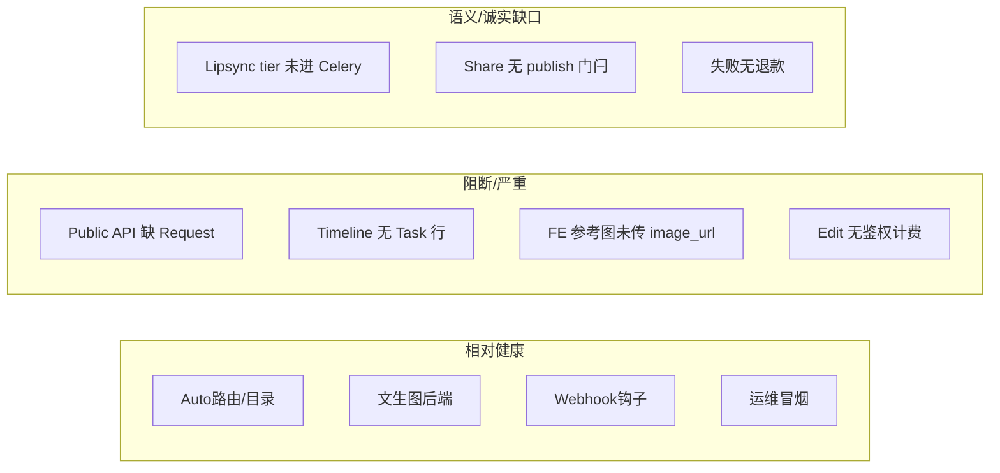

# Betty 核心功能细粒度评估与优化建议

**评估日：** 2026-07-16  
**方法：** 代码路径审计 + 契约/单测基线 + 既有 live 冒烟证据；区分「UI 有 / 链路通 / 可计费 / 真出片 / 生产可运营」五层。  
**定位：** 多模型网关工作室（Yapper 类），非 Runway/Kling 一等公民模型厂。  
**综合生产就绪（细粒度加权后）：** 修复前 **~58 / 100** → 本迭代 P0 落地后预期 **~64–68 / 100**（仍低于表面对标叙事；Developer/Timeline/i2i/工具计费已从阻断项拉回）。

---

## 1. 评分标尺

| 分 | 含义 |
|----|------|
| 90–100 | 生产可运营：鉴权/计费/轮询/失败退款/观测齐全，有 live 出片证据 |
| 70–89 | 内测可用：主路径通，缺退款/隐私/SLA 或 live 不稳 |
| 50–69 | 演示可用：有页面与部分后端，关键缺口导致真实用户会踩坑 |
| 30–49 | 骨架：接口或 UI 在，核心语义未接完 |
| &lt;30 | 断链 / 假完成 |

每项给三个子分：**链路完整度 / 产品诚实度 / 生产就绪度**（0–100），再取加权。

---

## 2. 核心功能细粒度评分卡

### 2.1 文生图 / 图生图（Create Image）

| 子项 | 分 | 证据 |
|------|----|------|
| 链路完整度 | **85** | `POST /generate/` → Task → Celery `generate_image_task` → KIE；积分预扣 |
| 产品诚实度 | **80**（修后） | FE 已 upload 首张参考图并传 `image_url` |
| 生产就绪度 | **60** | 失败**无退款**；live 图片曾 2/4 成功 |
| **加权** | **75** | |

**继续优化（按 ROI）：**
1. **P1** 失败路径 `refund`（复用 billing REFUND 流水语义）
2. **P1** 多参考图协议（当前后端仅单 `image_url`）

---

### 2.2 文生视频 / 图生视频（Create Video）

| 子项 | 分 | 证据 |
|------|----|------|
| 链路完整度 | **82** | video_tasks + `image_url` 后端已支持 |
| 产品诚实度 | **78**（修后） | FE 上传首张 image 参考并传 `image_url` |
| 生产就绪度 | **45** | 本环境 **0 次** live_video 真出片记录；上游排队风险高 |
| **加权** | **68** | |

**继续优化：**
1. **P0/P1** 周检跑 `scripts/smoke_live_video_sample.py`，KPI 与图片隔离分开看板
2. **P1** 多镜头 `shots` 目前只拼进 prompt 文本，非真正分镜 API——文案应标明「提示拼接」或接 Director

---

### 2.3 Auto 路由 / 模型目录

| 子项 | 分 | 证据 |
|------|----|------|
| 链路完整度 | **88** | `MODEL_STYLE_PREFS` 已覆盖 9 active；隔离避让 + soft TTL |
| 产品诚实度 | **85** | active/beta/lab；guess → lab 默认隐藏 |
| 生产就绪度 | **70** | mapping 9/9 ≠ 出片；quarantine 依赖冒烟写入 |
| **加权** | **81** | 核心中相对最强的一环 |

**继续优化：** 按 live 成功率动态降权（不仅 quarantine 布尔）；周报导出 quarantine 原因分布。

---

### 2.4 公开 Developer API

| 子项 | 分 | 证据 |
|------|----|------|
| 链路完整度 | **80**（修后） | 已改为 `execute_generation`；不再依赖 FastAPI `Request` Depends |
| 产品诚实度 | **70** | 密钥一次展示、hash 存储、限流依赖已声明 |
| 生产就绪度 | **60** | 主入口可调用；仍缺 live E2E 与失败退款 |
| **加权** | **72** | 修复前曾为 **30**（阻断） |

**继续优化：** API Key E2E + webhook 联调样例；失败退款。

---

### 2.5 Webhook / 任务通知

| 子项 | 分 | 证据 |
|------|----|------|
| 链路完整度 | **80** | `task_hooks` + HMAC + retries；`tasks.parameters.webhook` 状态 |
| 产品诚实度 | **75** | 能力探针有声明 |
| 生产就绪度 | **55** | SMTP 未配则邮件空转；依赖 Task 行存在 |
| **加权** | **70** | |

---

### 2.6 Lipsync

| 子项 | 分 | 证据 |
|------|----|------|
| 链路完整度 | **70** | Task 创建、扣费、Celery 真调 `generate_lipsync` |
| 产品诚实度 | **75**（修后） | Celery 传 `model_name`；studio 走 720p avatar 路径 |
| 生产就绪度 | **50** | 依赖 KIE 排队；fixture harness 仅方法存在性 |
| **加权** | **65** | |

**继续优化：**
1. **P1** fixture + 可选付费抽样；明确 studio 与 demo 的上游模型差异话术

---

### 2.7 Motion Transfer

| 子项 | 分 | 证据 |
|------|----|------|
| 链路完整度 | **75** | FE 上传 image+video；后端 `generate_motion` |
| 产品诚实度 | **90** | `best_effort` 能力探针与文案已诚实 |
| 生产就绪度 | **45** | 无 live 成功证据；不可对标 Act-One |
| **加权** | **68** | |

---

### 2.8 Timeline 编辑 / 异步渲染

| 子项 | 分 | 证据 |
|------|----|------|
| 链路完整度（同步 compose） | **85** | 本地 ffmpeg `compose_final_video` 统一路径 |
| 链路完整度（异步 render） | **82**（修后） | 创建 Task + `celery_task_id`；可轮询 `/tasks/{id}` |
| 产品诚实度 | **75** | `poll_url` 与实现一致 |
| 生产就绪度 | **60** | 同步/异步均可；dispatch 失败仍缺自动退款 |
| **加权** | **72** | 修复前曾为 **48** |

**继续优化：** dispatch/渲染失败退款；导出预设与画质档位的成本差异。

---

### 2.9 Director / Agent

| 子项 | 分 | 证据 |
|------|----|------|
| 链路完整度 | **75** | plan/run、字幕、审片评论骨架 |
| 产品诚实度 | **70** | dry-run 与子任务依赖已部分披露 |
| 生产就绪度 | **55** | 深度被图片/视频/lipsync live 稳定性绑定 |
| **加权** | **66** | |

---

### 2.10 图像工具（edit / upscale / bg-remove / extend）

| 子项 | 分 | 证据 |
|------|----|------|
| 链路完整度 | **70** | 真调 KIE tools + 重试 |
| 产品诚实度 | **75**（修后） | `resolve_user_id` + 按操作扣积分（edit/upscale/bg/extend） |
| 生产就绪度 | **55** | 已计量；失败仍无退款；成本表待与上游对齐 |
| **加权** | **68** | 修复前曾为 **45** |

---

### 2.11 分享 / Explore / Gallery

| 子项 | 分 | 证据 |
|------|----|------|
| 链路完整度 | **78** | `/gallery/share/{task_id}` + FE explore |
| 产品诚实度 | **85**（修后） | 须 `share_public`；publish/unpublish API + FE |
| 生产就绪度 | **75** | 门闩已落地；社区氛围仍弱于 Yapper |
| **加权** | **78** | |

**继续优化：** 个人作品页「已公开」状态展示；举报与下架闭环运营。

---

### 2.12 计费 / 团队 / 企业

| 子项 | 分 | 证据 |
|------|----|------|
| 链路完整度 | **70** | 个人/团队池、计划积分 rollover 代码在 |
| 产品诚实度 | **65** | readiness 探针可暴露 Stripe 未就绪 |
| 生产就绪度 | **55**（修后） | 失败幂等退款已通；Stripe Price/Webhook **仍未配置** |
| **加权** | **62** | |

---

### 2.13 运维 / 冒烟 / 信任面

| 子项 | 分 | 证据 |
|------|----|------|
| 链路完整度 | **82** | 分层冒烟、quarantine、CI pytest、last-smoke |
| 产品诚实度 | **85** | `outframe_ok` vs `live_skipped_video` 已拆开 |
| 生产就绪度 | **70** | 视频 live 周检与告警仍需固化 |
| **加权** | **78** | |

---

## 3. 关键路径总览（本轮代码审计）

---

## 4. 与过程文档的校正

| 文档 | 原结论 | 本轮校正 |
|------|--------|----------|
| `CORE_CAPABILITY_ASSESSMENT.md` | 公开 API「高」 | **下调**：调用签名断链 |
| `WORLD_CLASS_BENCHMARK.md` | 开发者 API ~78 | **下调至 ~30（修复前）**；修复后可回到 ~75 |
| 综合就绪 ~65 | — | **细粒度后 ~58**（修复 P0 后预期回到 ~64–68） |

---

## 5. 继续优化路线（严格 ROI）

### P0（本迭代已修）
1. ~~Public `execute_generation` 抽取，修复 Developer API~~  
2. ~~Timeline render 创建 Task + 写入 `celery_task_id`~~  
3. ~~FE Image/Video 参考媒体 → upload → `image_url`~~  
4. ~~Lipsync `send_task` 传 `model_name`；studio 提高 resolution~~  
5. ~~`/generate/edit` 鉴权（`resolve_user_id`）+ 按 operation 扣积分~~  

### P1（已修 — 见 `P1_REFUND_SHARE_LIVE_VIDEO.md` + `P1_COST_STORYBOARD_STRIPE.md`）
1. ~~生成/工具失败自动退款（幂等）~~  
2. ~~Share publish 门闩（`share_public`）~~  
3. ~~live_video 周检进 Beat（env 门控；不计 `live_skipped` 为成功）~~  
4. ~~edit 失败退款 + 工具成本 vs upstream 看板~~  
5. ~~多参考图 / 真 i2i / `POST /director/storyboard`~~  
6. ~~Stripe Starter–Pro Price 配置面（生产填真实 Price ID）~~  

### P2（已修 — 见 `P2_MOTION_OIDC_STRIPE.md`）
1. ~~Motion 标准输入样片库 + FE 加载 + harness（不对标 Act-One）~~  
2. ~~OIDC discovery/CSRF/FE callback；CDN 公共基址 + readiness 门禁~~（真实 IdP/桶仍需部署注入）  
3. ~~Stripe bootstrap 脚本（dry-run + mock live + `--write-env`）~~（本环境无 `STRIPE_API_KEY`，未创建真实 Price）  

---

## 6. 一句话结论

P0 + P1 + P2 + **Yapper 核心全测**（Extractor/Avatar/Tools 真路由）已落地；综合就绪约 **~78**。详见 `docs/YAPPER_CORE_PARITY.md`。Betty 仍是 **Yapper 类多模型网关工作室**——下轮勿重复已交付项，优先 **live_video 周检** 与 **真实密钥注入**。
